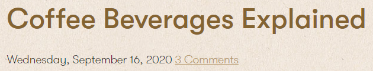
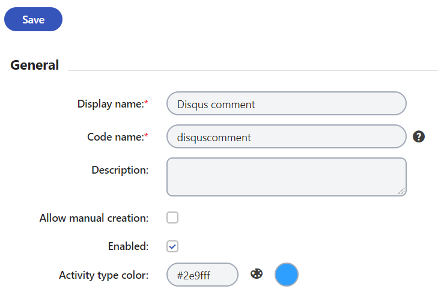

[](https://www.nuget.org/packages/Kentico.Xperience.Disqus.Widget.KX13)
[](https://stackoverflow.com/tags/kentico)

# Xperience Disqus Widget

The __Disqus comments__ widget for Kentico Xperience 13 provides an option to add a comment section to any page on your website. Disqus offers advanced moderation tools, analytics and monetization options. This integration also includes advanced [on-line marketing tools](#on-line-marketing-integration) to integrate Disqus with marketing automation, activities and macros.

## Prerequisite

This integration is compatible with any __Kentico Xperience 13 (version 13.0.32 or newer)__ project using the __ASP.NET Core__ development model. 

## Installation

1. Install the [Kentico.Xperience.Disqus.Widget.KX13](https://www.nuget.org/packages/Kentico.Xperience.Disqus.Widget.KX13) NuGet package in your live site Xperience project.
1. Open the [Disqus Admin](https://disqus.com/admin/) website.
    1. Select the "I want to install Disqus on my site" option if you haven't done so before.
    1. Create a new site (or select an existing one) and note the __Shortname__ from __Settings__ -> __General__ tab.
1. In your live-site project's `appsettings.json`, add the following setting:

```json
"xperience.disqus":  {
    "siteShortname": "my-awesome-site"
}
```

## Adding Disqus widget to your pages

The __Disqus comments__ widget can be added as a standard page builder widget to any page with the page builder where editable area restrictions and widget zone restrictions were adjusted accordingly.

Alternatively, the widget can be added directly to your views as a [standalone widget](https://docs.xperience.io/x/SQ2RBg):

```cs
@using Kentico.Xperience.Disqus.Widget.KX13

<standalone-widget widget-type-identifier="@DisqusComponent.IDENTIFIER" widget-properties="new DisqusComponentProperties()" />
```

There are 3 optional properties that you can configure:

- __Title__ - A custom title for the created Disqus thread. If not set, the `DocumentName` or HTML `title` will be used.
- __PageIdentifier__ - The [Disqus identifier](https://help.disqus.com/en/articles/1717082-what-is-a-disqus-identifier) of the created thread. If not set, the `DocumentGUID` is used.
- __CssClass__ - One or more classes to add to the `<div>` element that surrounds the Disqus comments.

The widget can be placed on _any_ view in your .NET Core project. However, if it is placed on a view without representation in the Xperience content tree, the __PageIdentifier__ property must be specified.

> :warning: Do not add more than one instance of the Discuss widget on a single page as only one instance can be loaded at once.

## Displaying links with comment counts

You can place a link to the comments section of any page by appending `#disqus_thread` to the URL. The link can also contain the number of comments on that page:



If you'd like to also display the number of comments, you can use the [default Disqus functionality](https://help.disqus.com/en/articles/1717274-adding-comment-count-links-to-your-home-page), which requires adding the `count.js` script along with the absolute URL. To get the URL of an Xperience page, you can use `IPageUrlRetriever`:

```cs
@inject IPageUrlRetriever urlRetriever

<a href="@(urlRetriever.Retrieve(node).AbsoluteUrl)#disqus_thread"></a>
```

# On-line marketing integration

## Logging On-line marketing activities

With this integration, you can log activities whenever a new comment is posted. If you have [text analytics](https://docs.xperience.io/x/XxffBw) enabled, the sentiment of the comment will be also logged with the activity. This is helpful during the creation of [marketing automation](https://docs.xperience.io/x/UgiRBg) processes or [contact groups](https://docs.xperience.io/x/ngiRBg). For example, if a contact leaves a positive comment on an article, you may want to send them an email offering a discount on the products advertised in the article.

To begin logging activities, configure the following custom [activity type](https://docs.xperience.io/x/_wiRBg) in __Contact management__ application -> __Configuration__ -> __Activity types__. Only the code name of the activity type needs to match exactly, the rest can be altered to meet your needs.



You also need to register a comment activity route in your project:
```cs
app.UseEndpoints(endpoints =>
{
    endpoints.Kentico().MapRoutes();
    ...
    endpoints.MapDisqusActivityTracking();
...
```

## Triggering marketing automation processes

You can reference these activies to trigger [marketing automation](https://docs.xperience.io/x/UgiRBg) processes. For example, you may want to trigger a process when a positive comment is left on a specific page:

- Trigger:
    - __Display name__: Positive comment on article
    - __Type__: Contact performed an activity
    - __Activity type__: Disqus comment
    - __Additional condition__: `Activity.ActivityValue == "positive" && Activity.Node.NodeAliasPath == "/Articles/Coffee-Beverages-Explained"`

You could also check the comment's sentiment in an [if/else](https://docs.xperience.io/x/3A_RBg) step to create a process with multiple branches. Remove the __Additional condition__ from the above trigger so the process runs for all comments. Then, set up your process something like this:


In the if/else condition, you can check the sentiment of the triggering activity in the `AutomationState` object:

`AutomationState.StateCustomData["TriggerDataActivityValue"] == "negative"`

In this example, if the comment is negative the contact will be sent an email after 1 day. If it is positive, the contact is added to a contact group.

## Creating macro rules

These activities can be used in conditional [contact groups](https://docs.xperience.io/x/ngiRBg) and other on-line marketing functionality by creating your own [macro rules](https://docs.xperience.io/x/7gyRBg). The following steps create a macro rule that can be used in a contact group which contains contacts who left a comment with the chosen sentiment in the last X days:

1. Navigate to __Contact management__ application -> __Configuration__  -> __Macro rules__ and select __New macro rule__:
    - __Display name__:"Contact commented on Disqus"
    - __User text__: "Contact left a {sentiment} comment in the last {days} days"
    - __Condition__: `Contact.DidActivity("disquscomment", "", {days}, "ActivityValue='{sentiment}'")`
2. Save and switch to the __Parameters tab__
3. On the __sentiment__ property, change the control to __Drop-down list__ and under __List of options__, add:
    - positive
    - negative
    - neutral
    - mixed
4. On the __days__ property, change the __Data type__ to __Integer number__.

Your marketers can now use this rule when creating contact groups:


## Questions & Support

See the [Kentico home repository](https://github.com/Kentico/Home/blob/master/README.md) for more information about the product(s) and general advice on submitting questions.
