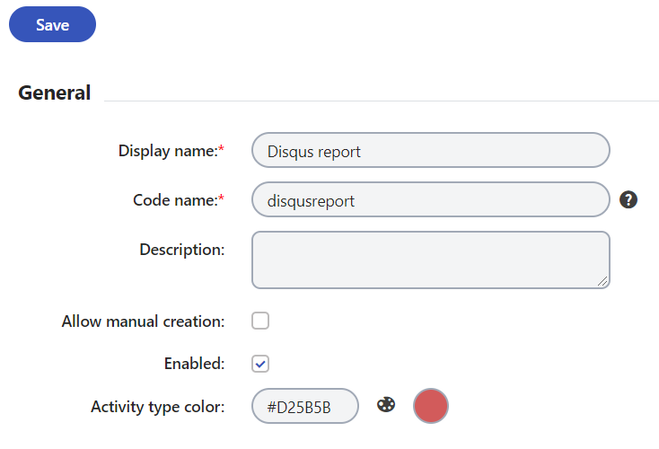

# Xperience Disqus Widget

Readme under construction

## Installation

1. Install this package in your .NET Core project
1. Create a [new application](https://disqus.com/api/applications/register/)
1. On the __Settings__ tab, set the __Callback URL__ to `https://<your MVC site>/disqus/auth`
1. Switch to the __Details__ tab and note the keys under the __OAuth Settings__ section
1. Open the [Disqus Admin](https://disqus.com/admin/)
1. If you see "What would you like to do with Disqus?" select "I want to install Disqus on my site"
1. Create a new site (or select an existing one) and note the __Shortname__ on the __Settings > General tab__
1. In your MVC project's startup code, initialize the Disqus integration: `services.AddDisqus();`
1. In your MVC project's `appsettings.json`, add the following section:

```json
"Disqus": {
    "Site": "<Shortname from step 5>",
    "ApiKey": "<API key from step 4>",
    "ApiSecret": "<API secret from step 4>",
    "AuthenticationRedirect": "https://<your MVC site>/disqus/auth"
}
```
## Requirements

The integration is currently built on __Kentico.Xperience.AspNetCore.WebApp__ 13.0.32

---

The default layout requires Bootstrap and jQuery. The following resources should be added to your main `_Layout.cshtml`:

```html
   <link href="https://cdn.jsdelivr.net/npm/bootstrap@5.1.1/dist/css/bootstrap.min.css" rel="stylesheet" integrity="sha384-F3w7mX95PdgyTmZZMECAngseQB83DfGTowi0iMjiWaeVhAn4FJkqJByhZMI3AhiU" crossorigin="anonymous">
   <script src="https://code.jquery.com/jquery-3.2.1.slim.min.js" integrity="sha384-KJ3o2DKtIkvYIK3UENzmM7KCkRr/rE9/Qpg6aAZGJwFDMVNA/GpGFF93hXpG5KkN" crossorigin="anonymous"></script>
   <script src="https://maxcdn.bootstrapcdn.com/bootstrap/4.0.0/js/bootstrap.min.js" integrity="sha384-JZR6Spejh4U02d8jOt6vLEHfe/JQGiRRSQQxSfFWpi1MquVdAyjUar5+76PVCmYl" crossorigin="anonymous"></script>
```

---

Your MVC project's routing must contain a "catch-all" route:

```cs
endpoints.MapControllerRoute(
    name: "default",
    pattern: "{controller}/{action}",
    defaults: new {
        controller = "Home",
        action = "Index"
    }
);
```

Or, you can register a custom route for Disqus:

```cs
endpoints.MapControllerRoute(
    name: "Disqus",
    pattern: "disqus/{action}",
    defaults: new {
        controller = "Disqus"
    }
);
```

## Adding Disqus to your pages

The Disqus widget can be added as a standard pagebuilder widget, or directly to your views as a [standalone widget](https://docs.xperience.io/developing-websites/page-builder-development/rendering-widgets-in-code):

```cs
@using Disqus.Components.DisqusComponent

@{
    var widgetProperties = new DisqusComponentProperties()
    {
        Header = "Reviews"
    };
}
<standalone-widget widget-type-identifier="@DisqusComponent.IDENTIFIER" widget-properties="widgetProperties" />
```

There are 2 optional properties that you can configure:

- __Header__ (default: "Comments") - The text that appears above the comments
- __ThreadIdentifier__ (default: current DocumentGUID) - The [Disqus identifier](https://help.disqus.com/en/articles/1717082-what-is-a-disqus-identifier) of the thread to load comments for. This is an arbitrary string which can be used to load comments from any Disqus thread, even if it is not related to the current page

The widget can be placed on _any_ view in your .NET Core project. However, if it is placed on a page without representation in the Xperience content tree, you _must_ set the __ThreadIdentifier__ property.

## Logging On-line Marketing activities

With this integration, you can log activities whenever a new comment is posted or a comment is reported by another user. If you have enabled [Text analysis](https://docs.xperience.io/configuring-xperience/managing-sites/configuring-settings-for-sites/settings-content/settings-text-analytics), the sentiment of the comment will be logged with the activity, otherwise all comments will have the "neutral" sentiment.

This could be helpful in the creation of [Marketing automation](https://docs.xperience.io/on-line-marketing-features/managing-your-on-line-marketing-features/marketing-automation) processes or [contact groups](https://docs.xperience.io/on-line-marketing-features/managing-your-on-line-marketing-features/contact-management/segmenting-contacts-into-contact-groups). For example, if a contact leaves a positive comment on an article, you may want to send them an email offering a discount on the article's advertised products. Or, if a comment is reported by other users, a site administrator can reach out to the commenter to try and defuse the situation.

To begin logging activities, configure either (or both) of the following [activity types](https://docs.xperience.io/on-line-marketing-features/configuring-and-customizing-your-on-line-marketing-features/configuring-activities/adding-custom-activity-types), depending on which you'd like to log. Only the code names of the activity types need to match exactly- the rest can be altered to meet your needs.




## Displaying links with comment counts

You can place a link to the comments section of any page by appending `#disqus_thread` to the URL. The link can also contain the number of comments on that page:


If you'd like to also display the number of comments, you can use the [default Disqus functionality](https://help.disqus.com/en/articles/1717274-adding-comment-count-links-to-your-home-page), which requires adding the `count.js` script along with the absolute URL. To get the URL of an Xperience page, you can use `IPageUrlRetriever`:

```cs
@inject IPageUrlRetriever urlRetriever

<a href="@(urlRetriever.Retrieve(node).AbsoluteUrl)#disqus_thread"></a>
```

